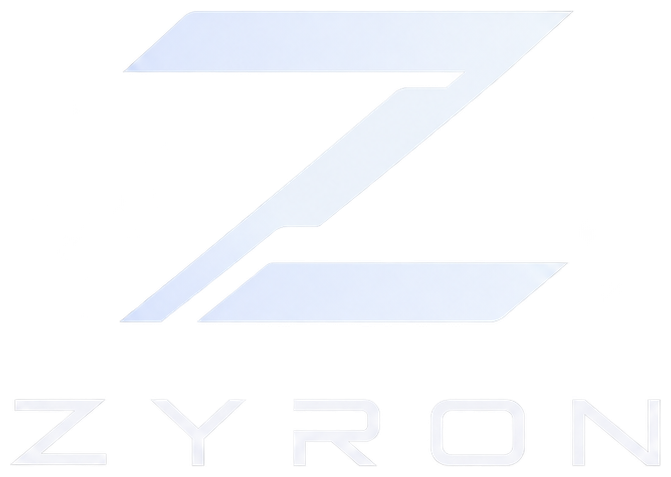
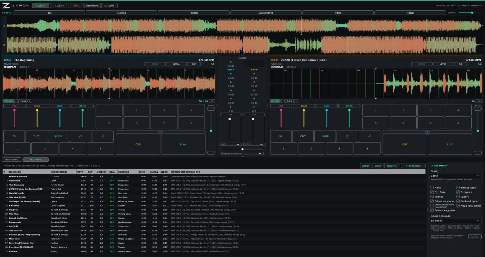

<div align="center">



### The DJ software that mixes like a DJ — beat-locked decks, neural stems and an AI that actually listens to the drop.

[](LICENSE)


[**Download 0.1**](https://github.com/Kelll31/ZYRON/releases/latest) · [Features](#features) · [Automix](#the-ai-automix) · [Build](#build-from-source) · [По-русски](#по-русски)



</div>

---

ZYRON is a native C++ DJ application: two or four decks, a real-time audio engine that never allocates or blocks on the
audio thread, neural stem separation, local AI analysis and an autonomous AI-DJ — all running **offline on your own
machine**. No cloud, no subscription, no account.

**DJ software first, AI second.** Switch every AI feature off and ZYRON is still a complete DJ tool. Switch it on and it
plans a set from your library, finds the drops, and mixes track into track on the beat: blends, filter sweeps, loop rolls,
echo-outs, scratches, double drops and acapella-over-beat stem mixes.

> **0.1 is an alpha.** It plays, mixes and records, and the automix lands most transitions — but expect rough edges.
> Bug reports with the track names and a screenshot are gold.

## Features

### Decks and mixer
- **2 or 4 decks** with a global waveform overview and zoomable detail waveforms (beat grid, markers, planned transitions).
- **Beat-accurate SYNC** — tempo match plus phase alignment done on the audio thread in the very block a deck starts.
- **Keylock (master tempo)** powered by Signalsmith Stretch: change the tempo, keep the pitch. **Key shift** ±6 semitones.
- Hot cues, loops (1/2…8 beats, halve/double), pitch fader, CUE/PLAY, slip-style scratches.
- **Mixer**: gain, 3-band EQ with full kills, DJ filter, channel faders, crossfader with curves, per-channel cue.
- **Channel FX**: echo, reverb, flanger, phaser, delay — beat-synced, with tails that keep ringing after the fader closes.
- **FX hits**: air horn, siren, riser, downlifter, impact, laser — synthesized, beat-synced, no sample licences.
- **Master bus**: auto-loudness per track (EBU R128), glue compressor and a true look-ahead limiter at −0.3 dBFS.
- **Recording** of the master output. Click-free everything: every parameter is smoothed.

### Stems
- **Neural stem separation** (HTDemucs via ONNX Runtime) into vocals, drums, bass and other — prepared in the background
  as soon as a track is loaded, cached on disk.
- Per-stem mute and volume on every deck; the automix uses stems for acapella-over-beat transitions.

### Analysis and library
- **Neural beat tracking** (Beat This!) and **key detection** (S-KEY, Camelot), with DSP fallbacks when no weights are
  installed.
- **Structure**: drops (including the short "micro drops" at the end of a track), breakdowns, intro/outro, mix-in and
  mix-out points on the phrase grid counted from the first drop; silent tails are never played.
- **Loudness** (BS.1770 LUFS), per-bar **energy profile**, **vocal regions**.
- The whole analysis is saved next to your music in **`zyron-analysis.json`** — a new library, another PC or a reinstall
  reads it instead of analysing again.
- SQLite library with incremental folder scans, search, status column with ETA, and automatic recovery of a damaged
  database.

### The AI automix
ZYRON's automix is built around how DJs actually mix:

- **Plans a whole set** from your analysed tracks along an energy curve, with key and tempo compatibility scores — and
  explains every choice ("Adjacent key (+1/−1). Higher energy.").
- **The drop decides.** The incoming track starts exactly so that its drop lands on the last beat of the transition — the
  outgoing track is gone by then. The transition starts on a bar of the outgoing track, sample-accurately phase locked.
- **The check before every mix:** if the outgoing track would hit its next drop during the transition, the mix is
  shortened or the outgoing track loops the bars before its drop so the drop never comes.
- **Transitions:** three-band EQ blend with bass swap, filter sweep, beat loop-in, loop roll, echo out, reverb out,
  turntable brake, scratch routines (baby, transformer, chirp, flare, crab, tear, stab, backspin…), cut on the drop,
  double drop (keys must fit) and acapella stem blend.
- **Harmonic mixing:** clashing keys are shifted a semitone or two into a compatible key (keylock keeps the tempo).
- **Energy-aware:** a jump up gets a punchier entry, a step down a smoother exit. Two vocals are never stacked.
- **Tempo that settles unnoticed:** after a mix the new track glides back to its own tempo over about a minute.
- **Mix modes:** *Smooth* (streaming-app easy listening, on the beat), *Club*, *Battle* (scratches, rolls, cuts, FX hits)
  or *Custom* — and per-track transition choices in the queue. Styles you keep picking by hand become favourites.
- Live **Mix next**: pick a track, press it, and the playing deck is mixed into it right now.
- Everything the automix does moves the knobs and faders on screen, and you can grab any control at any time.

## Download

Grab **`ZYRON-0.1.0-windows-x64.zip`** from the [latest release](https://github.com/Kelll31/ZYRON/releases/latest),
unzip anywhere and run `ZYRON.exe`.

**AI models (optional but recommended).** Beat tracking, key detection and stems use open neural networks (MIT
licensed, ~500 MB). Without them ZYRON falls back to DSP analysis and has no stems. To install them, run in the unzipped
folder:

```powershell
powershell -ExecutionPolicy Bypass -File .\download_models.ps1 -Destination .\models
```

The script lists every file and its size, asks first, downloads from Hugging Face and verifies each file's SHA-256.

Requirements: Windows 10/11 x64, a recent CPU (AVX2). A GPU is not needed. macOS and Linux build from source today;
packaged builds come later.

## Build from source

You need CMake ≥ 3.25, a C++20 compiler (MSVC 2022, Clang 16+ or GCC 13+), Ninja, and [vcpkg](https://vcpkg.io) for
SQLite. JUCE, Catch2, Signalsmith Stretch and ONNX Runtime are fetched and pinned by CMake.

```bash
cmake --preset windows-release          # or macos-release / linux-release, *-debug
cmake --build --preset windows-release
ctest --preset windows-release --output-on-failure
```

More in [docs/DEV_SETUP.md](docs/DEV_SETUP.md). CUDA is optional (`ZYRON_ENABLE_CUDA`); all tests pass without a GPU.

## Architecture in one breath

```
src/
  Core/         Commands, state, events — standard C++ only
  Audio/        engine, decks, mixer, DSP, keylock, FX, routing      (real-time safe)
  Library/      SQLite, scanner, metadata, analysis queue
  Analysis/     beat grid, key, energy, structure, loudness, vocals
  Stems/        HTDemucs separation and the stem cache
  AI/           ONNX runtime, set builder, transition planner, autonomous DJ
  MIDI/  Recording/  UI/  Platform/  Application/ (composition root)
```

One **Command API** for everything: the UI, MIDI and the AI all issue the same commands, and nothing touches the
engine directly. The audio thread never allocates, locks, logs or waits; commands reach it through a lock-free queue.
Decisions are recorded as ADRs in [docs/DECISIONS.md](docs/DECISIONS.md); the plan lives in
[docs/ROADMAP.md](docs/ROADMAP.md).

## Status and roadmap

0.1 is the first public alpha: Windows build, two/four decks, stems, the AI automix and its settings, English and
Russian UI. Next up: tuning the remaining transitions, vocal detection on real material, MIDI-learn for the new
controls, macOS/Linux packages, GPU stem separation and a first-party DJ model trained on how you mix.

## License

ZYRON is free software under the **GNU Affero General Public License v3.0** — see [LICENSE](LICENSE). It uses JUCE
under the AGPLv3. Third-party components and model licences are listed in
[THIRD_PARTY_NOTICES.md](THIRD_PARTY_NOTICES.md). The Windows package includes ONNX Runtime (MIT) and DirectML
(Microsoft DirectML redistributable licence).

---

## По-русски

**ZYRON** — нативное диджейское приложение на C++: 2 или 4 деки, реалтайм-движок, разделение на стемы нейросетью,
локальный ИИ и автодиджей. Всё работает офлайн на твоём компьютере, без облака и подписок.

- **Деки и микшер:** SYNC с фазой до сэмпла, keylock, сдвиг тональности, хот-кью, лупы, скретчи, 3-полосный
  эквалайзер, фильтр, эффекты на каналах (эхо, реверб, фланжер, фейзер, дилей), FX-удары (горн, сирена, райзер…),
  автогромкость по LUFS, компрессор и лимитер на мастере, запись.
- **Стемы:** вокал / барабаны / бас / остальное, готовятся в фоне сразу после загрузки трека.
- **Анализ:** BPM и сетка (нейросеть Beat This!), тональность (S-KEY), дропы, точки входа и выхода по фразам,
  громкость, энергия, вокал. Разбор сохраняется рядом с музыкой в `zyron-analysis.json`.
- **Автомикс:** строит сет, ведёт переход так, чтобы дроп входящего трека пришёлся на конец перехода, проверяет, не
  начнётся ли дроп уходящего, сам подстраивает тональность и громкость. Переходы: микс с обменом баса, фильтр, луп бита,
  луп-ролл, уход в эхо/реверб, тормоз, скретчи, обрыв на дропе, двойной дроп, акапелла на стемах. Режимы: «Плавно»,
  «Клуб», «Баттл», «Свой».
- **Интерфейс** на русском и английском (Опции → Общие → Язык).

**Скачать:** архив `ZYRON-0.1.0-windows-x64.zip` в [релизах](https://github.com/Kelll31/ZYRON/releases/latest),
распаковать и запустить `ZYRON.exe`. Нейросети (около 500 МБ) ставятся скриптом `download_models.ps1` из архива.

Лицензия — **AGPLv3**.
